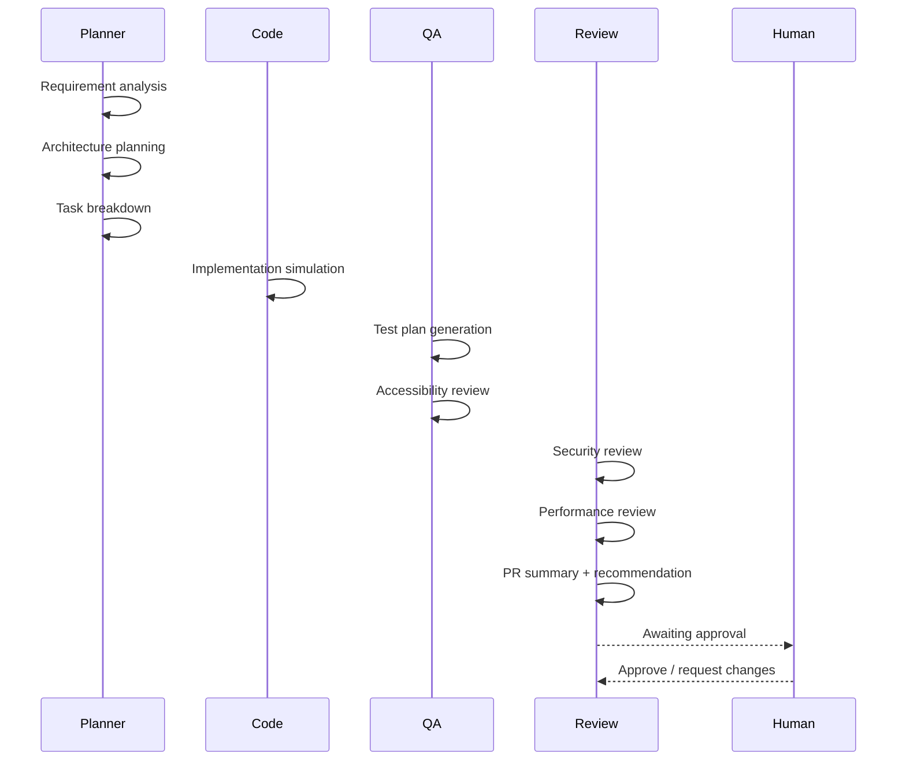
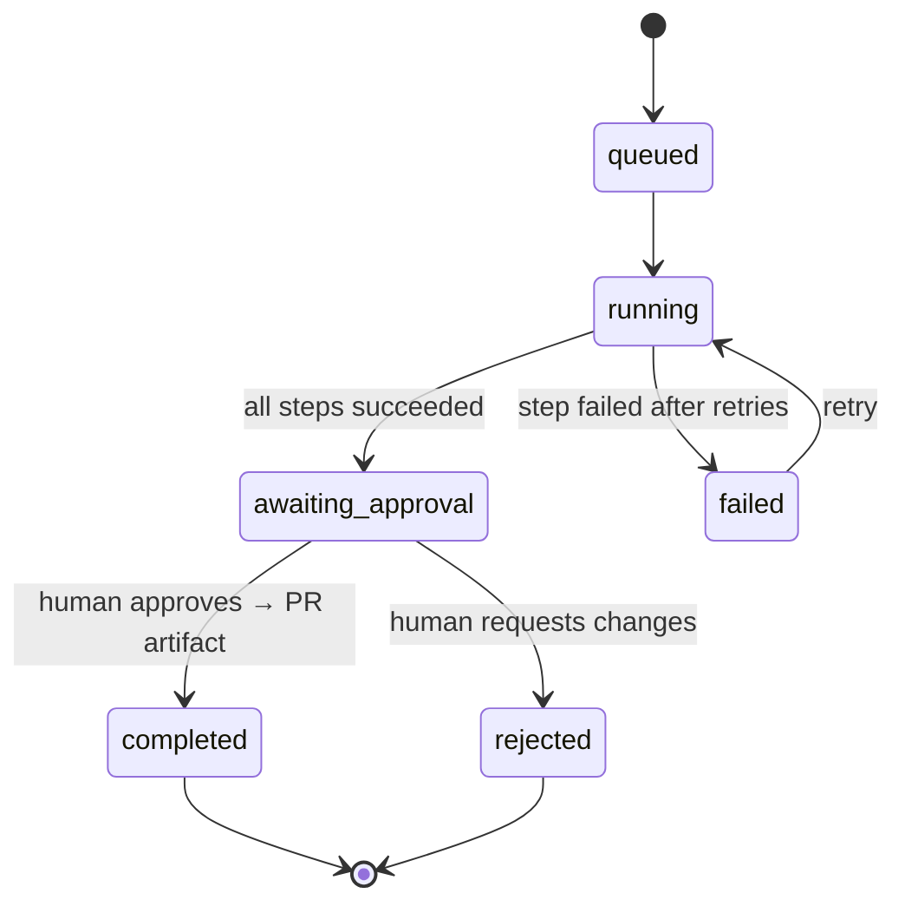

# Forge — Software Engineering Agent Platform

> A control center for software-engineering agents. Submit a feature request and
> watch a team of specialist agents plan it, simulate the implementation, write a
> test plan, run quality gates, and produce a pull-request-ready artifact — with a
> human approving before anything ships.

Forge is **not** a coding chatbot. It models how an agentic software-delivery
platform actually works: a typed runtime engine, four specialist agents, scored
quality gates, full per-step observability (tokens / cost / retries / logs), and
an explicit human-in-the-loop approval gate before the final artifact is created.

It runs entirely in **mock mode** with **zero API keys** — every external
dependency (the LLM, the database) sits behind a clean seam so it can be made
live without touching the app.

```bash
pnpm install && pnpm dev   # → http://localhost:3000
```

---

## Why this project exists

Most "AI coding" demos are a single prompt → a single blob of code. Real agentic
engineering tools need **structure**: decomposition, specialization, traceability,
quality gates, and human control. Forge demonstrates that structure end-to-end —
the architecture, the typed domain model, and the seams — in a way that's easy to
read, run, and extend.

It was built as a portfolio piece for roles involving agent-system architecture,
full-stack TypeScript, React/Next.js, and AI-assisted engineering workflows.

## Screenshots

**Dashboard** — throughput, quality, cost, and the awaiting-approval queue.


**Workflow detail** — agent timeline with expandable typed outputs, quality gates, approval, and logs.


**PR artifact** — pull-request-ready summary, copyable as Markdown.


## Feature tour

- **New request** — describe a feature like you'd brief an engineer (title,
  description, framework, complexity, risk, acceptance criteria). Zod-validated.
- **Multi-agent run** — nine steps across four agents execute, with retries on
  transient failure and graceful skip-on-failure.
- **Workflow detail** — request summary, an **agent timeline** with expandable
  typed outputs per step, scored **quality gates**, a streaming-style **log**, an
  **approval panel**, and the generated **PR artifact**.
- **Human-in-the-loop** — runs pause at `awaiting_approval`; you approve (→ PR
  artifact) or request changes (→ rejected).
- **PR artifact** — title, summary, implementation plan, files changed, testing
  plan, risks, reviewer checklist, rollback plan — **copyable as Markdown**.
- **Dashboard** — totals, completion/failure counts, awaiting-approval queue,
  average duration, average quality score, total estimated cost, recent runs.

---

## Architecture


Three deliberate seams keep the app decoupled from any provider:

| Seam | Interface | Mock today | Production |
|---|---|---|---|
| **Model** | `LanguageModel` / `ModelDescriptor` | deterministic simulator | Claude via Anthropic SDK |
| **Persistence** | `Repository` | seeded in-memory store | Supabase (`schema.sql` included) |
| **Agents** | `Agent` | deterministic generators | same interface, LLM-backed |

The whole domain model is **JSON-serializable** (string-literal unions, ISO
timestamps, no class instances), so the same objects flow unchanged from the
in-memory store into Supabase `jsonb` columns — the persistence seam costs nothing.

### The multi-agent workflow



Each agent produces a **typed, differently-shaped output** (a plan has `tasks`,
a review has `findings`). `StepOutput` is a discriminated union keyed by `kind`,
so a single `switch` narrows to the exact payload — no `any`, no guesswork in the
renderer.

### Runtime state machine



### Quality gates

After the agents finish, six gates are computed deterministically from their
outputs — **TypeScript safety, Accessibility, Performance risk, Security risk,
Test coverage, Maintainability** — each with a `passed | warning | failed`
status, a 0–100 score, and an explanation. The workflow's overall quality score
is a weighted mean (security and coverage weighted higher).

### Observability

Every step records its agent, status, attempt count, duration, token estimate,
cost estimate, and logs. Token/cost are estimated from input/output size against
a real pricing table, so the numbers are believable even in mock mode — exactly
what a real agentic tool needs for traceability.

---

## Tech stack

- **Next.js 16** (App Router, Turbopack, React Server Components)
- **React 19** · **TypeScript** (strict, no `any`)
- **Tailwind CSS v4** (CSS-first `@theme` tokens, dark UI)
- **Zod** for input validation (Server Actions are the trust boundary)
- **Supabase-ready** persistence layer (Postgres schema included)
- Zero runtime UI dependencies beyond React — icons are inline SVG

## Project structure

```
src/
  app/                      # routes: /, /dashboard, /requests/new,
                            #         /workflows, /workflows/[id],
                            #         /artifacts, /artifacts/[id], /settings
  components/
    ui/                     # design-system primitives (Card, Button, Badge…)
    domain/                 # workflow timeline, step output, quality gates…
    shell/                  # sidebar + topbar app shell
  lib/
    engineering-agent/      # the runtime engine
      types.ts              #   domain model (discriminated unions)
      schema.ts             #   Zod input validation
      mock-model.ts         #   model adapter seam + pricing/estimators
      agents/               #   planner · code · qa · review
      step-plan.ts          #   the fixed 9-step pipeline
      runtime.ts            #   orchestration, retries, approval
      quality-gates.ts      #   six scored gates
      logger.ts             #   observability
    store/                  # persistence seam
      repository.ts         #   the Repository interface
      memory-store.ts       #   in-memory adapter (demo)
      supabase-adapter.ts   #   documented Supabase skeleton
      seed.ts               #   4 demo workflows (runs the real engine)
    actions.ts              # Server Actions
supabase/schema.sql         # production Postgres schema
docs/                       # architecture, original prompt, changelog
```

## Local setup

Requires Node 20+ and pnpm.

```bash
pnpm install
pnpm dev        # http://localhost:3000
pnpm build      # production build
pnpm start      # serve the production build
pnpm lint       # eslint
```

No environment variables are needed — the app seeds four demo workflows on first
load and runs the agents deterministically.

## Environment variables

All optional; only needed to go beyond mock mode. See `env.example` (copy to `.env.local`).

| Variable | Enables |
|---|---|
| `ANTHROPIC_API_KEY` | the Claude model adapter |
| `SUPABASE_URL` | Postgres persistence |
| `SUPABASE_SERVICE_ROLE_KEY` | Postgres persistence |

## Plugging in a real LLM

1. Implement `LanguageModel.generate()` (see `mock-model.ts`) against the
   Anthropic SDK.
2. Swap each agent's deterministic generator for a call that sends the request +
   prior outputs and parses a Zod-validated structured response.
3. Register the model descriptor with `ready: true`.

Agents, runtime, quality gates, and UI are untouched — that's the point of the seam.

## Going to Supabase

1. `pnpm add @supabase/supabase-js`
2. Apply `supabase/schema.sql`.
3. Implement `SupabaseRepository` (the skeleton in `supabase-adapter.ts` documents
   every query).
4. In `store/index.ts`, return the Supabase adapter when its env vars are set.

## Deployment

Deploys cleanly to **Vercel** (zero config for Next.js) or any Node host
(`pnpm build && pnpm start`). The demo needs no env vars. The in-memory store is
per-process — wire the Supabase adapter for shared, durable state.

## Roadmap

- [ ] Real Claude adapter (structured output via Zod)
- [ ] Supabase adapter implementation + auth
- [ ] Live step streaming (Server-Sent Events) instead of synchronous runs
- [ ] Workflow replay & run-vs-run comparison
- [ ] Model selector with live cost tracking
- [ ] Command palette + dark/light theme toggle

---

## Notes for reviewers

This started from a single-page build brief (kept verbatim at
[`docs/PROMPT.md`](docs/PROMPT.md)). The design decisions, trade-offs, and the
mock-vs-real seams are written up in
[`docs/ARCHITECTURE.md`](docs/ARCHITECTURE.md).

Built with Next.js 16, React 19, and TypeScript.
