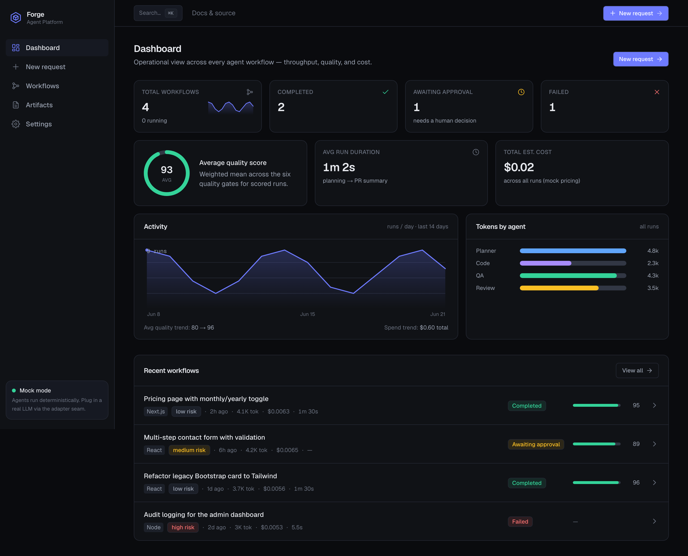
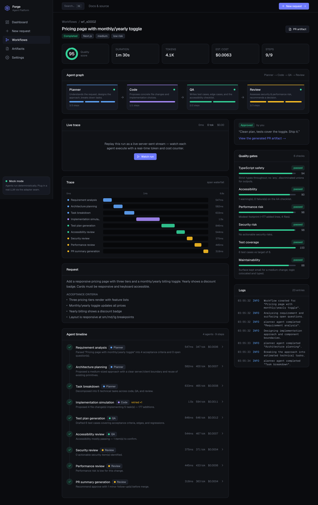
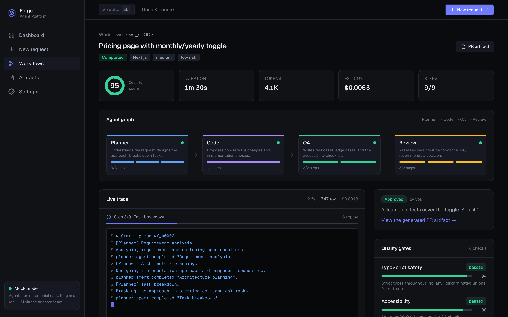
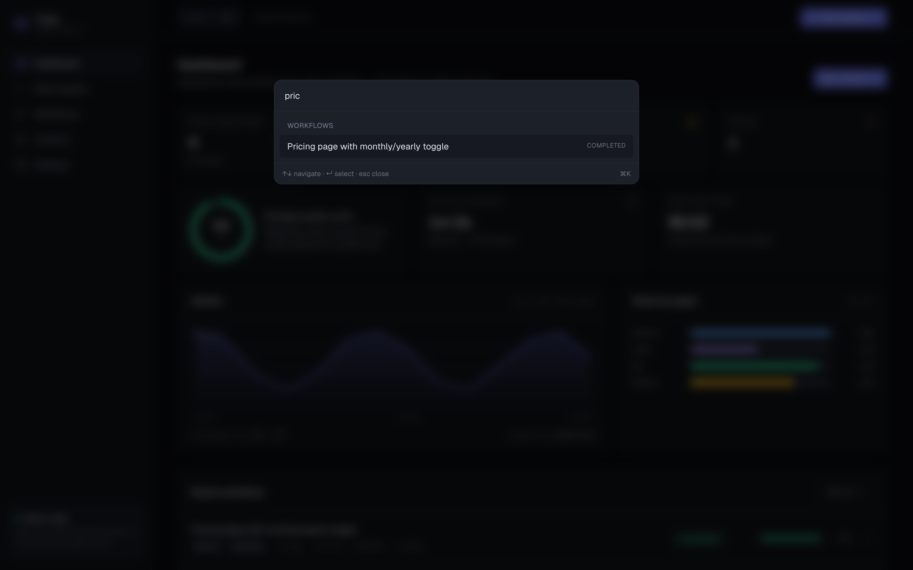
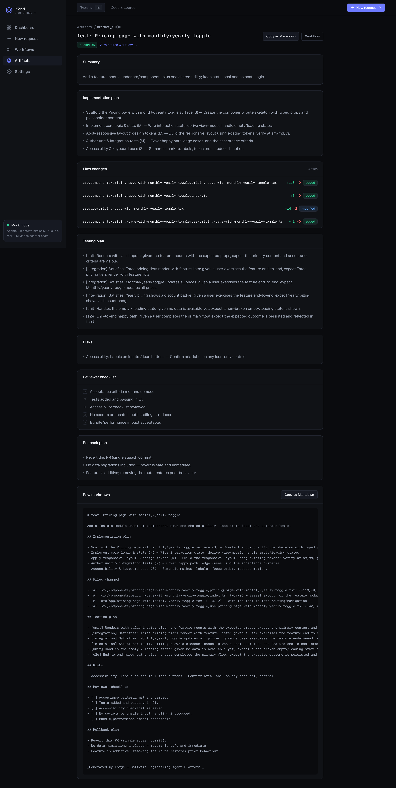
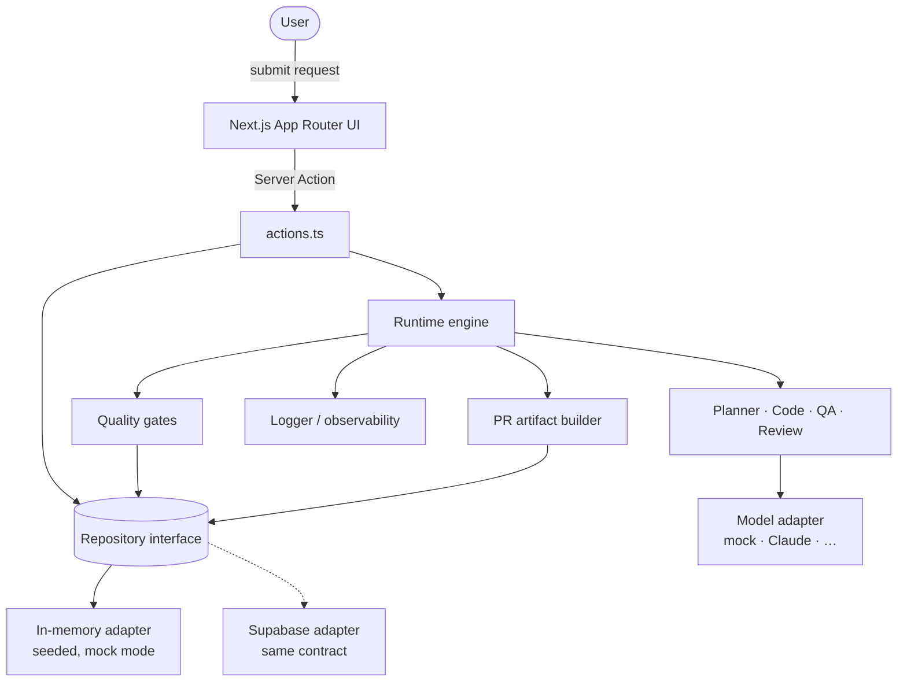
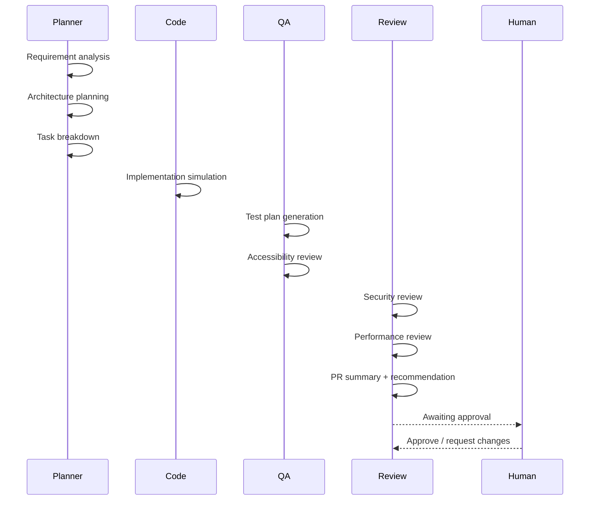
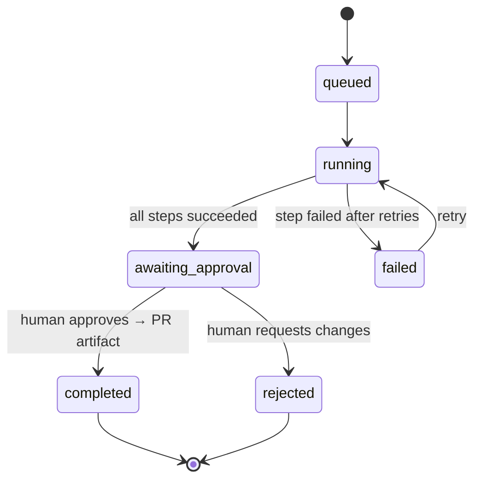

<div align="center">

# 🛠️ Forge — Software Engineering Agent Platform

**A control center for software-engineering agents.**
Submit a feature request and watch a team of specialist agents plan it, simulate the
implementation, write a test plan, run quality gates, and produce a pull-request-ready
artifact — with a human approving before anything ships.

[](https://nextjs.org)
[](https://react.dev)
[](https://www.typescriptlang.org)
[](https://tailwindcss.com)
[](https://zod.dev)


[](https://github.com/mikulgohil/se-agent-platform/actions/workflows/ci.yml)
[](LICENSE)

</div>

---

Forge is **not** a coding chatbot. It models how an agentic software-delivery platform
actually works: a typed runtime engine, four specialist agents, scored quality gates,
full per-step observability (tokens / cost / retries / logs), and an explicit
human-in-the-loop approval gate before the final artifact is created.

It runs entirely in **mock mode** with **zero API keys** — every external dependency
(the LLM, the database) sits behind a clean seam so it can be made live without
touching the app.

```bash
pnpm install && pnpm dev   # → http://localhost:3000
```

## Table of contents

- [Why this project exists](#why-this-project-exists)
- [Screenshots](#screenshots)
- [Quick start](#quick-start)
- [Feature tour](#feature-tour)
- [Architecture](#architecture)
  - [System overview](#system-overview)
  - [The three seams](#the-three-seams)
  - [The multi-agent workflow](#the-multi-agent-workflow)
  - [Runtime state machine](#runtime-state-machine)
- [The agents](#the-agents)
- [The pipeline](#the-pipeline-9-steps)
- [Quality gates](#quality-gates)
- [Domain model](#domain-model)
- [Observability](#observability)
- [Tech stack](#tech-stack)
- [Project structure](#project-structure)
- [Local setup](#local-setup)
- [Environment variables](#environment-variables)
- [Going to production](#going-to-production)
- [Roadmap](#roadmap)
- [Notes for reviewers](#notes-for-reviewers)

---

## Why this project exists

Most "AI coding" demos are a single prompt → a single blob of code. Real agentic
engineering tools need **structure**: decomposition, specialization, traceability,
quality gates, and human control. Forge demonstrates that structure end-to-end — the
architecture, the typed domain model, and the seams — in a way that's easy to read,
run, and extend.

It was built as a portfolio piece for roles involving **agent-system architecture,
full-stack TypeScript, React/Next.js, and AI-assisted engineering workflows**.

What it's meant to show:

- I can design an **agent runtime** (orchestration, retries, state transitions, HITL)
  rather than just call an LLM.
- I model domains with a **rigorous type system** (discriminated unions, no `any`).
- I build for **swappability** — mock today, real provider tomorrow, no rewrite.
- I ship **polished, accessible product UI**, not a toy.

## Screenshots

**Dashboard** — throughput, quality, cost, and the awaiting-approval queue.



**Workflow detail** — agent graph, a live SSE trace, a span waterfall, the agent timeline, quality gates, approval, and logs.



**Live trace (SSE)** — replay a run as a real server-sent stream: agents execute step-by-step with a ticking token / cost / elapsed counter.



**Command palette (⌘K)** — keyboard-first navigation and fuzzy search across every workflow.



**PR artifact** — pull-request-ready summary, copyable as Markdown.



## Quick start

Requires **Node 22+** and **pnpm** (pnpm 11 needs Node ≥ 22.13).

```bash
git clone https://github.com/mikulgohil/se-agent-platform.git
cd se-agent-platform
pnpm install
pnpm dev          # http://localhost:3000
```

No environment variables are needed — the app seeds four demo workflows on first load
and runs the agents deterministically. Open `/dashboard`, or hit **New request** and
load an example to watch a fresh run.

## Feature tour

- **New request** — describe a feature like you'd brief an engineer (title,
  description, target framework, complexity, risk level, acceptance criteria).
  Zod-validated, with one-click examples.
- **Multi-agent run** — nine steps across four agents execute, with retries on
  transient failure and graceful skip-on-failure.
- **Workflow detail** — an **agent graph** (Planner → Code → QA → Review with live
  per-node status), a **live SSE trace** you can replay, a **span waterfall**, an
  **agent timeline** with expandable typed outputs, scored **quality gates**, a
  **log** stream, an **approval panel**, and the generated **PR artifact**.
- **Live streaming** — replay any run as real Server-Sent Events: steps execute
  one-by-one with a ticking token / cost / elapsed counter and a streaming terminal.
- **Dashboard analytics** — activity trend chart, tokens-by-agent breakdown, and
  sparklines, all hand-rendered in SVG (no charting dependency).
- **Command palette (⌘K)** — keyboard-first navigation + fuzzy workflow search.
- **Human-in-the-loop** — runs pause at `awaiting_approval`; you approve (→ PR
  artifact) or request changes (→ rejected). Failed runs offer a **retry**.
- **PR artifact** — title, summary, implementation plan, files changed, testing plan,
  risks, reviewer checklist, rollback plan — **copyable as Markdown** to paste
  straight into GitHub.
- **Dashboard** — totals, completion/failure counts, awaiting-approval queue, average
  duration, average quality score, total estimated cost, recent runs.
- **Settings** — model registry with pricing, the architecture seams, and the env vars
  needed to go live.

---

## Architecture

### System overview



The UI never mutates state directly — it goes through **Server Actions** (the trust
boundary, where Zod validation lives). Read paths (React Server Components) call the
`Repository` interface. The runtime is a set of **pure async functions over plain
data**: it returns new state and persists nothing, so any storage adapter can drive it.

### The three seams

Three deliberate seams keep the app decoupled from any provider:

| Seam | Interface | Mock today | Production |
|---|---|---|---|
| **Model** | `LanguageModel` / `ModelDescriptor` | deterministic simulator | Claude via Anthropic SDK |
| **Persistence** | `Repository` | seeded in-memory store | Supabase (`schema.sql` included) |
| **Agents** | `Agent` | deterministic generators | same interface, LLM-backed |

The whole domain model is **JSON-serializable** (string-literal unions, ISO timestamps,
no class instances), so the same objects flow unchanged from the in-memory store into
Supabase `jsonb` columns — the persistence seam costs nothing.

### The multi-agent workflow



Each agent produces a **typed, differently-shaped output** (a plan has `tasks`, a
review has `findings`). `StepOutput` is a discriminated union keyed by `kind`, so a
single `switch` narrows to the exact payload — no `any`, no guesswork in the renderer.

### Runtime state machine



---

## The agents

Four agents implement a common `Agent` interface (`name`, `handles`, async `run`). A
registry maps each step to its owning agent, so the runtime never hard-codes who does
what.

| Agent | Owns | Produces |
|---|---|---|
| 🧭 **Planner** | requirement analysis, architecture planning, task breakdown | clarified requirements, open questions, approach, components, data flow, trade-offs, estimated tasks |
| ⌨️ **Code** | implementation simulation | concrete file changes (path, +/- lines, kind) with illustrative snippets and notes |
| 🧪 **QA** | test plan, accessibility review | typed test cases (unit/integration/e2e/a11y), edge cases, regression risks, WCAG checklist |
| 🛡️ **Review** | security review, performance review, PR summary | severity-ranked findings + an approval recommendation with a confidence score |

In mock mode each agent generates its structured output **deterministically** and
reports token/cost **estimated from the size of the synthetic prompt + serialized
output** against a real pricing table — so the observability numbers are believable
without any network call. To go live you implement `LanguageModel.generate()` once and
switch each agent to call it with a Zod-validated structured response.

## The pipeline (9 steps)

Every workflow runs this fixed pipeline in order; outputs feed forward as context.
Human approval is a workflow-level gate after step 9, not a step.

| # | Step | Agent |
|---|---|---|
| 01 | Requirement analysis | Planner |
| 02 | Architecture planning | Planner |
| 03 | Task breakdown | Planner |
| 04 | Implementation simulation | Code |
| 05 | Test plan generation | QA |
| 06 | Accessibility review | QA |
| 07 | Security review | Review |
| 08 | Performance review | Review |
| 09 | PR summary generation | Review |
| → | **Human approval** | _you_ |

## Quality gates

After the agents finish, six gates are computed deterministically from their outputs.
Each has a `passed | warning | failed` status, a 0–100 score, and an explanation. The
workflow's overall quality score is a **weighted mean** (security and coverage weighted
higher).

| Gate | Derived from |
|---|---|
| TypeScript safety | strict-typing baseline of the proposed change |
| Accessibility | warnings/failures on the QA agent's WCAG checklist |
| Performance risk | performance findings + bundle/line delta |
| Security risk | severity of the security agent's findings |
| Test coverage | test-case count vs. a target derived from acceptance criteria |
| Maintainability | change complexity and surface area |

## Domain model

Everything is JSON-serializable and lives in `src/lib/engineering-agent/types.ts`.

| Type | Purpose |
|---|---|
| `EngineeringRequest` | the user's feature brief (title, framework, complexity, risk, acceptance criteria) |
| `AgentWorkflow` | a run: status, quality score, token/cost totals, approval, artifact ref |
| `WorkflowStep` | one pipeline step: agent, status, typed `output`, error, attempts, timing, tokens, cost |
| `StepOutput` | **discriminated union** — one variant per step kind (the type-system centerpiece) |
| `QualityGate` | name, status, score, explanation |
| `WorkflowLog` | level, message, timestamp, optional metadata |
| `PullRequestArtifact` | title, summary, plan, files, testing, risks, checklist, rollback |

Design choices worth calling out:

- **String-literal unions, not enums** — `as const` arrays double as the type *and* the
  runtime list used to render selects.
- **ISO string timestamps, not `Date`** — no serialization surprises across the
  server/client boundary or into `jsonb`.
- **Injected `{ now, id }` dependencies** — production passes a real clock + UUIDs; the
  seed passes a fixed clock + deterministic counter, so seeds are reproducible and the
  engine is unit-testable.

## Observability

Every step records its agent, status, attempt count, duration, token estimate, cost
estimate, and logs. The detail page surfaces all of it: a timeline, a log stream, and a
metrics strip. Step timing is synthesized deterministically from output size, so a mock
run produces a realistic timeline and seed data renders identically on every build.

---

## Tech stack

- **Next.js 16** (App Router, Turbopack, React Server Components)
- **React 19** · **TypeScript** (strict, no `any`)
- **Tailwind CSS v4** (CSS-first `@theme` tokens, dark UI, semantic design tokens)
- **Zod** for input validation (Server Actions are the trust boundary)
- **Supabase-ready** persistence layer (Postgres schema included)
- **Server-Sent Events** for live run streaming (native `EventSource`)
- **Motion** (page/stream transitions) + **cmdk** (⌘K palette) — the only runtime
  UI deps; all charts, the waterfall, and the agent graph are hand-coded SVG
  (see [ADR 0001](docs/decisions/0001-visualization-and-streaming.md))

## Project structure

```
src/
  app/                      # routes: /, /dashboard, /requests/new,
                            #         /workflows, /workflows/[id],
                            #         /artifacts, /artifacts/[id], /settings
  components/
    ui/                     # design-system primitives (Card, Button, Badge…)
    domain/                 # workflow timeline, step output, quality gates…
    shell/                  # sidebar + topbar app shell
  lib/
    engineering-agent/      # the runtime engine
      types.ts              #   domain model (discriminated unions)
      schema.ts             #   Zod input validation
      mock-model.ts         #   model adapter seam + pricing/estimators
      agents/               #   planner · code · qa · review
      step-plan.ts          #   the fixed 9-step pipeline
      runtime.ts            #   orchestration, retries, approval
      quality-gates.ts      #   six scored gates
      logger.ts             #   observability
    store/                  # persistence seam
      repository.ts         #   the Repository interface
      memory-store.ts       #   in-memory adapter (demo)
      supabase-adapter.ts   #   documented Supabase skeleton
      seed.ts               #   4 demo workflows (runs the real engine)
    actions.ts              # Server Actions
supabase/schema.sql         # production Postgres schema
docs/                       # architecture, original prompt, changelog, screenshots
```

## Local setup

```bash
pnpm install
pnpm dev        # http://localhost:3000
pnpm build      # production build
pnpm start      # serve the production build
pnpm lint       # eslint
pnpm typecheck  # tsc --noEmit
pnpm test       # vitest run
```

### Testing

The engine is framework-free (pure functions over plain data), so it's unit-tested
in a plain Node environment — fast, no jsdom. The suite (31 tests) covers the runtime
(success, retry-then-succeed, fail-and-skip, determinism), quality gates, Zod input
parsing, the agents + registry, the Markdown exporter, and a `MemoryStore` integration
test of the full create → approve → artifact flow.

```bash
pnpm test          # run once
pnpm test:watch    # watch mode
```

CI (GitHub Actions) runs lint → typecheck → test → build on every push and PR.

## Environment variables

All optional; only needed to go beyond mock mode. See `env.example` (copy to `.env.local`).

| Variable | Enables |
|---|---|
| `ANTHROPIC_API_KEY` | the Claude model adapter |
| `SUPABASE_URL` | Postgres persistence |
| `SUPABASE_SERVICE_ROLE_KEY` | Postgres persistence |

## Going to production

**Plug in a real LLM**

1. Implement `LanguageModel.generate()` (see `mock-model.ts`) against the Anthropic SDK.
2. Swap each agent's deterministic generator for a call that sends the request + prior
   outputs and parses a Zod-validated structured response.
3. Register the model descriptor with `ready: true`.

Agents, runtime, quality gates, and UI are untouched — that's the point of the seam.

**Move to Supabase**

1. `pnpm add @supabase/supabase-js`
2. Apply `supabase/schema.sql`.
3. Implement `SupabaseRepository` (the skeleton in `supabase-adapter.ts` documents
   every query).
4. In `store/index.ts`, return the Supabase adapter when its env vars are set.

**Deploy**

Deploys cleanly to **Vercel** (zero config for Next.js) or any Node host
(`pnpm build && pnpm start`). The demo needs no env vars. The in-memory store is
per-process — wire the Supabase adapter for shared, durable state.

## Roadmap

- [x] Live step streaming via Server-Sent Events
- [x] Agent graph (DAG) view + span-waterfall trace
- [x] Dashboard analytics (activity trend, tokens-by-agent, sparklines)
- [x] Command palette (⌘K) + keyboard navigation
- [ ] Real Claude adapter (structured output via Zod)
- [ ] Supabase adapter implementation + auth
- [ ] Run-vs-run comparison / experiment diff
- [ ] Evals & score-over-time analytics page
- [ ] Model selector with live cost tracking + dark/light theme toggle

## Notes for reviewers

This started from a single-page build brief (kept verbatim at
[`docs/PROMPT.md`](docs/PROMPT.md)). The design decisions, trade-offs, and the
mock-vs-real seams are written up in [`docs/ARCHITECTURE.md`](docs/ARCHITECTURE.md), and
the build log is in [`docs/CHANGELOG.md`](docs/CHANGELOG.md).

Built with Next.js 16, React 19, and TypeScript.

## License

[MIT](LICENSE) © Mikul Gohil
